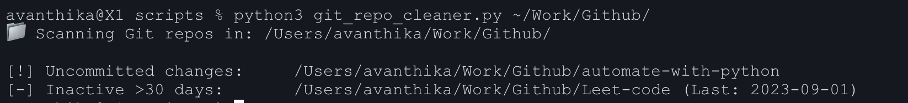

# Git Repo Auditor

A Python script to **analyze and report the status** of all Git repositories within a given directory.

## 🔍 What It Does

This script recursively scans a directory for Git repositories and reports:

-  **Uncommitted Changes**: Repos with local changes not yet staged or committed.
-  **Ahead of Remote**: Repos that have local commits not yet pushed.
-  **Behind Remote**: Repos that are missing commits from the remote.
-  **Inactive Repos**: Repos with no commits in the last **30 days**.

## Features

- Scans nested folders for `.git` directories.
- Uses `git status` and `git log` to assess health and activity.
- Helps developers **organize, clean, and maintain** their local projects.
- No dependencies except Python 3 and Git.

## Usage

```bash
python3 git_repo_auditor.py /path/to/your/projects
```

## Screenshots




